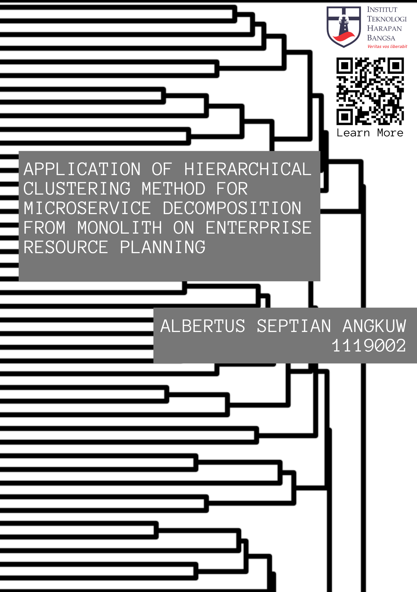

#  Penerapan Microservice dengan Hierarchical Clustering untuk Dekomposisi dari Monolitik pada Enterprise Resource Planning

## Abstract [ID]
Aplikasi Enterprise Resource Planning (ERP) dapat dibangun dengan arsitektur Monolitik, Service Oriented Architecture, dan Microservice. Arsitektur monolitik merupakan arsitektur sederhana namun monolitik tidak mudah dilakukan scaling dan sulit dikembangkan secara berkelanjutan sedangkan Microservice merupakan arsitektur modern yang cocok pada aplikasi perusahaan yang telah tumbuh dengan skala secara vertikal maupun horizontal. Manfaat dari microservice membuat perusahaan melakukan migrasi aplikasi berarsitektur monolitik menjadi arsitektur microservice. Namun proses ini terbukti sulit dan mahal, salah satu tantangan adalah bagaimana mengidentifikasi komponen dari aplikasi monolitik. Identifikasi dapat dilakukan secara semi-otomatis yang menggunakan algoritma clustering. Algoritma clustering yang digunakan yaitu Hierarchical Clustering dimana terdapat linkage seperti single linkage, complete linkage, dan average linkage. Penelitian ini menggunakan Odoo sebagai aplikasi ERP yang dilakukan dekomposisi dari monolitik menjadi Microservice dengan pendekatan menganalisis graph dari kode program kemudian memasukan graph ke Hierarchical Clustering. Hasil dari pengelompokan diuji dengan melihat cohesion dan coupling untuk setiap linkage kemudian dilakukan pemilihan bagian yang di implementasikan. Berdasarkan pengujian ditemukan linkage yang cocok untuk membuat kelompok service yang memiliki coupling dan cohesion yang baik adalah Average linkage. Pemilihan jumlah service yang ideal pada Average linkage dimulai dari 175-245 service. Dari struktur tabel yang terbentuk ketika implementasi menunjukan Hierarchical Clustering dapat memisahkan module yang tidak terhubung dan service yang memiliki hubungan kuat, seperti pada kasus di partisi ke-10 dengan Module Product dan Module Point of Sale dan pada kasus di partisi ke-17 dengan Module Calendar.

## Abstract [EN]
Enterprise Resource Planning (ERP) applications can be built using Monolith Architecture, Service-Oriented Architecture, and Microservice. The Monolith architecture is simple but lacks scalability and sustainability in development, while Microservice architecture is a modern approach suitable for vertically and horizontally scaled enterprise applications. The benefits of Microservice architecture have led companies to migrate from Monolith architecture to Microservices. However, this migration process has proven to be hard and costly, particularly in identifying the components of the Monolith application. Component identification can be semi-automated using clustering algorithms. The clustering algorithm used is Hierarchical Clustering which has linkages such as single linkage, complete linkage, and average linkage. In this research, Odoo, an ERP application, is decomposed from Monolith to Microservices by analyzing the program’s code graph then inserting the graph into Hierarchical Clustering. The results of the clustering are tested by evaluating cohesion and coupling for each linkage, followed by selecting the parts to be implemented. Based on the testing, it was found that the Average linkage is suitable for creating service clusters with good coupling and cohesion. The ideal number of services in the Average linkage ranges from 175 to 245 services. From the table structure that is formed when implementation shows Hierarchical Clustering can separate unconnected modules and identify services with strong relationships, as in case in the 10th partition with Module Product and Module Point of Sale and on case on the 17th partition with Module Calendar.

## Repository Structure

- `App/`: Contains the source code for this research.
- `Laporan/`: Contains Latex for generate the research report.
- `Laporan_TA.pdf`: Laporan TA (ID) PDF [ [here](/Laporan/index.pdf) ].
- `Journal.pdf`: Journal TA (ID) PDF [ [here](/Laporan/journal.pdf) ].

## Poster

